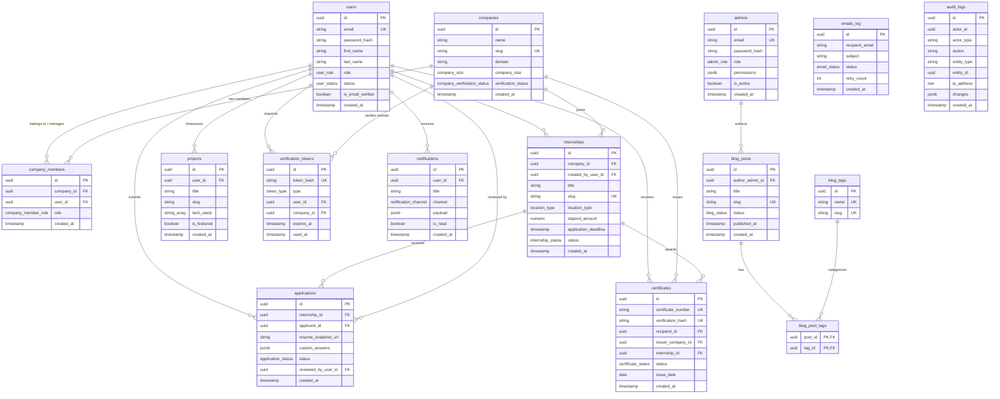

# Zalvy Production Database Architecture & ER Diagram

This document details the production relational database design for the **Zalvy Platform**.

---

## 1. Entity-Relationship (ER) Diagram

---

## 2. Key Design Principles

### Primary Keys & Data Types

- **UUID v4**: Primary keys on all tables utilize `gen_random_uuid()` for distributed security and prevent sequential enumeration attacks.
- **TIMESTAMPTZ**: All timestamp columns use `TIMESTAMPTZ` (UTC storage) for time-zone invariance across microservices.
- **JSONB**: Utilized for dynamic parameters (audit changes diff, notification payload, custom application answers, admin granular permissions).

### Referential Integrity & Cascades

- **`ON DELETE CASCADE`**: Applied to tightly coupled dependent entities:
  - `company_members` -> `companies` / `users`
  - `applications` -> `internships` / `users`
  - `projects` -> `users`
  - `notifications` -> `users`
- **`ON DELETE RESTRICT`**: Applied to preserve business transaction histories:
  - `internships` -> `companies` / `users` (Deleting a company or creator user will be blocked if active internships exist).
  - `blog_posts` -> `admins`
- **`ON DELETE SET NULL`**: Applied to non-critical relationships:
  - `certificates` -> `companies` / `internships` (Certificate remains valid for the student even if the issuing entity is removed).

### Constraints & Indexes

1. **Uniqueness Constraints**:
   - `users(email)`
   - `companies(slug)`
   - `internships(slug)`
   - `applications(internship_id, applicant_id)` (Prevents duplicate applications)
   - `certificates(certificate_number)` and `certificates(verification_hash)`
   - `projects(user_id, slug)`
   - `blog_posts(slug)`
2. **Domain Check Constraints**:
   - Email regex format enforcement on `users` & `admins`.
   - `stipend_amount >= 0`, `duration_months > 0`, `openings_count > 0` on `internships`.
3. **Optimized Performance Indexes**:
   - **Composite B-Tree Indexes**: `internships(status, location_type, application_deadline)` for fast search queries.
   - **Partial Indexes**: `verification_tokens(token_hash) WHERE used_at IS NULL AND expires_at > CURRENT_TIMESTAMP` for ultra-fast OTP lookups.
   - **GIN Indexes**: `audit_logs.changes`, `notifications.payload`, `applications.custom_answers` for fast JSON searching.
